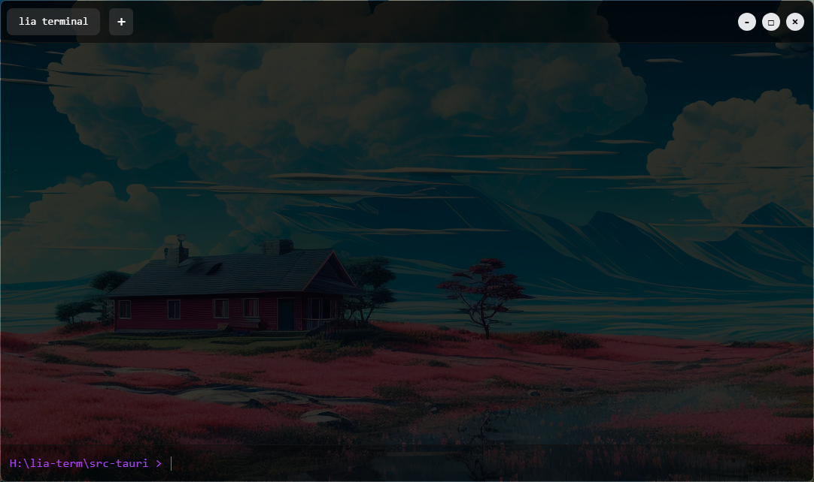

# Lia Terminal

##  Overview  
**Lia Terminal** is a modern, lightweight terminal emulator built using **TypeScript, React, Rust, and Tauri v2**. It aims to provide a sleek and efficient terminal experience while leveraging web technologies for flexibility and ease of development.  

> 🛠 **Note:** This project is currently under development. Some features are incomplete, and cross-platform support is still in progress.  

## ✨ Features  
- 🖥 **Modern UI** – A sleek and minimalistic interface.  
- ⚡ **Fast & Lightweight** – Runs efficiently on Windows, using around **50 - 60MB RAM** (may improve in future updates).  
- 🌐 **Web-Based Technologies** – Built using React and Rust for performance and flexibility.  
- 🔄 **Cross-Platform Support** – *Currently under development (Only works on Windows for now).*  

## 📸 Screenshots  
  

## 🔧 Installation  
### Prerequisites  
- Windows 10/11  
- Node.js (for development)  
- Rust & Cargo (for building the backend)  

### Clone & Run  
```sh
git clone https://github.com/yourusername/lia-terminal.git  
cd lia-terminal  
npm install  
npm run tauri dev  
